# Diseno De Minapp
Los mockups fueron realizados primeramente en Canva y seguido el prototipo en Marvel los recursos a esto lo encontraran al final del documento. En este documento solo se mostraran las pantallas mas importantes el resto las pueden ver en la seccion de recursos. 

## 1. Login

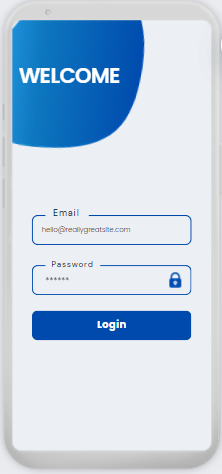

Depende el del rango de la persona dentro del trabajo lo que se le mostraria seria distinto si es un guarda de seguridad este tendra acceso a los registros, en caso de ser un supervisor o la central estos tendran acceso a los reportes.
Tras el Login encontraras la siguiente Imagen:

Tras el Login se encontrara con la siguiente Imagen:

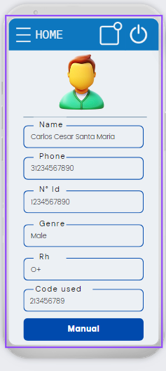
## 2. Acciones del Guarda de Seguridad

  ###   - Observations
  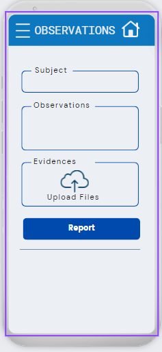
  ###   - Pedestrian Access
  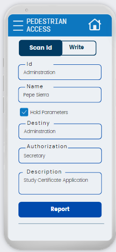
  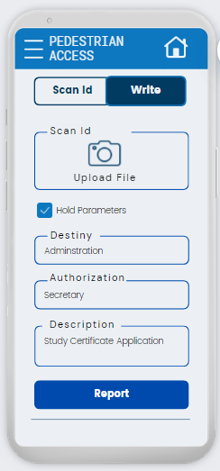
  ###   - Vehicular
  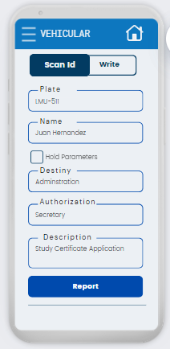
  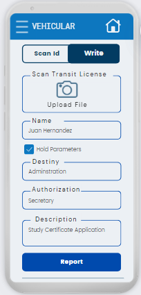
  ###   - Element
  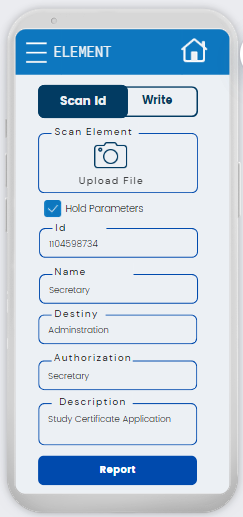
  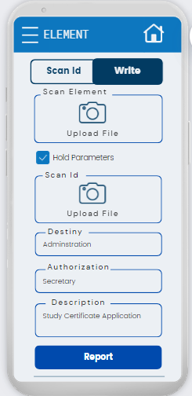
  ###   - Report
  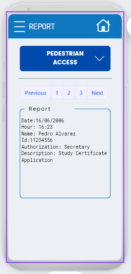

## 3. Acciones de Supervisores o Central
  ###   - Search Headquarters
  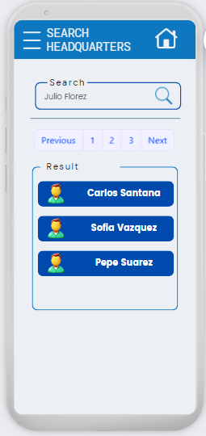
  ###   - Search Employee
  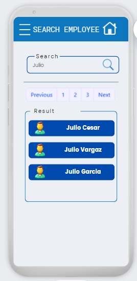

## Alcance Parcial
En pro de una entrega funcional para este proyecto solo se trabajara la seccion del Guarda de Seguridad siendo que en futuro se agregaran mas funciones como el chat empresarial y las UI de Administrador

## Alcance de Esta Entrega
Primeramente esta entrega agrega la Screen Chat igual que su funcionalidad para volver a la pagina de donde fue llamada, se traen los datos de la base de datos con respecto al usuario que ingresa a la aplicacion.
Para esta entrega se tuvo problemas con Firebase esto con respecto a firestore database, sin embargo se esta manejando y para una proxima entrega se entrega logica completa.
  ### Datos de Prueba
  Email = pruebas@gmail.com
  password = pruebas1234
  Email = Zone@gmail.com
  password = zone234
  Realizar esto sin dejar espacios, sino la aplicacion lo reconoce como uno diferente

  La ultima version se encuentra en la rama Zone, esta por el momento tiene toda las ultimas implementaciones asu vez de un error con respecto a la pantalla    Observations siendo este motivo unos componentes que se estan usando para cargar las imagenes

  Para esta entrega tambien se cambio el emulador en el que se corre, por un error en la configuracion y ahora se esta usando el emulador de un pixel 8 pro 
  con el API 35

## Recursos:

[Design_Canvas](https://www.canva.com/design/DAGDz1qTpTM/9IeqHv_WUc76YYqTC1fo3A/view?mode=prototype)
[Marvel-Prototipo](https://marvelapp.com/prototype/10caei9h)
